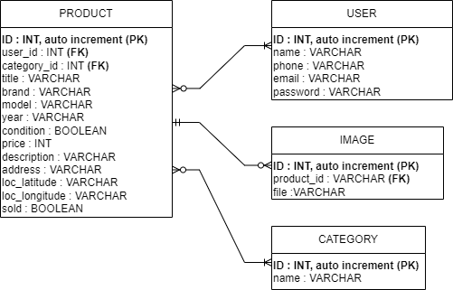

### exshop sample
1 . User registrasi melalui email, satu email hanya bisa digunakan untuk satu akun (filter middleware)
2 . User login kemudian mendapatkan token (JWT)
3 . Token digunakan untuk melihat profile, create new product, show product by ID user

### ERD

### Diagram

